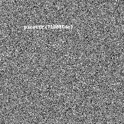

# Cryptography

*Solved: 6, Points: 620*
| Challenges | Points |
| ---- | ---- |
| [Mod 26](#mod-26-10-pts) | 10 pts |
| [Easy Peasy](#easy-peasy-40-pts) | 40 pts |
| [New Caesar](#new-caesar-60-pts) | 60 pts |
| [Pixelated](#pixelated-100-pts) | 100 pts |
| [Play Nice](#play-nice-110-pts) | 110 pts |
| [New Vignere](#new-vignere-300-pts) | 300 pts |

## Mod 26 (10 pts)

>Cryptography can be easy, do you know what ROT13 is? `cvpbPGS{arkg_gvzr_V'yy_gel_2_ebhaqf_bs_ebg13_nSkgmDJE}`  

Pretty simple question just use a [ROT13 decoder](https://rot13.com/) and get the flag: `picoCTF{next_time_I'll_try_2_rounds_of_rot13_aFxtzQWR}`

*_Taya*

## Easy Peasy (40 pts)

>A one-time pad is unbreakable, but can you manage to recover the flag? (Wrap with picoCTF{})  
`nc mercury.picoctf.net 58913` [otp.py](https://mercury.picoctf.net/static/e87ba627b72932bdb57b31bbac3c22c5/otp.py)  
Hint: Maybe there's a way to make this a 2x pad.

*_Taya*

## New Caesar (60 pts)

>We found a brand new type of encryption, can you break the secret code? (Wrap with picoCTF{})  
`lkmjkemjmkiekeijiiigljlhilihliikiliginliljimiklligljiflhiniiiniiihlhilimlhijil` [new_caesar.py](https://mercury.picoctf.net/static/c9043977604318594ab73d126a01d0b1/new_caesar.py)  
Hint 1: How does the cipher work if the alphabet isn't 26 letters?  
Hint 2: Even though the letters are split up, the same paradigms still apply  

*_Taya*

## Pixelated (100 pts)

>I have these 2 images, can you make a flag out of them? [scrambled1.png](https://mercury.picoctf.net/static/9f2d081f12c05202359632c1989e7927/scrambled1.png) [scrambled2.png](https://mercury.picoctf.net/static/9f2d081f12c05202359632c1989e7927/scrambled2.png)  
Hint 1: [https://en.wikipedia.org/wiki/Visual_cryptography](https://en.wikipedia.org/wiki/Visual_cryptography)  
Hint 2: Think of different ways you can "stack" images  

The Wikipedia page from Hint 1 talks about visual cryptography in which an image can be broken into multiple other images which when printed on transparencies and stacked, reveal the original image.
I used Photoshop to stack the two pngs given in the challenge statement.
It took a lot of playing around and trying random stuff out, changing the “blending mode” of one of the layers to “Hard Mix” did the trick:

 

After using a white filter and desaturating the image to grayscale (to make the picture less seizure-inducing), the flag was clearer but figuring out the exact characters still took a pit of guesswork (Thank you Taya!)

 

The flag: `picoCTF{7188864c}`  

*_Tiare & Taya*

## Play Nice (110 pts)

>Not all ancient ciphers were so bad... The flag is not in standard format. `nc mercury.picoctf.net 19354` [playfair.py](https://mercury.picoctf.net/static/9ea1604c8767cd6545948ad54670c2bf/playfair.py)  

So when I solved this in the competition I looked at the playfair.py file and actually wrote a python script to decrypt the plaintext they give when connecting to `nc mercury.picoctf.net 19354`. 

Afterwards I realized at the bottom of playfair.py there is a link to a [wikepedia page](https://en.wikipedia.org/wiki/Playfair_cipher). Apparently it is a well known cipher. You can use this [playfair cipher decrypter](https://www.dcode.fr/playfair-cipher) or any other one you find online. Input that alphabet they give you in a 6x6 grid. Then just decrypt the message they give you and submit it to get the flag: `dbc8bf9bae7152d35d3c200c46a0fa30`

*_Taya*

## New Vignere (300 pts)

>Another slight twist on a classic, see if you can recover the flag. (Wrap with picoCTF{})  
`ilnipdjheipnenhhedionepegiejmleoehejfcnimdgehimnepedhhfbafmcgdek` [new_vignere.py](https://mercury.picoctf.net/static/d86ead586609c44b84b04e08966a4d35/new_vignere.py)  
Hint: [https://en.wikipedia.org/wiki/Vigen%C3%A8re_cipher#Cryptanalysis](https://en.wikipedia.org/wiki/Vigen%C3%A8re_cipher#Cryptanalysis)  

*_Taya*