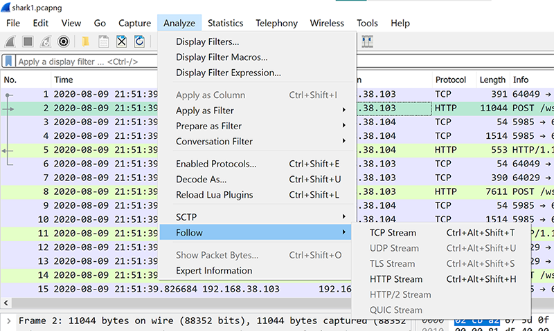

# Forensics

*Solved: 6, Points: 350*
| Challenges | Points |
| ---- | ---- |
| [Information](#information-10-pts) | 10 pts |
| [Weird file](#weird-file-20-pts) | 20 pts |
| [Matryoshka doll](#matryoshka-doll-30-pts) | 30 pts |
| [Wireshark doo dooo do doo...](#wireshark-doo-dooo-do-doo-50-pts) | 50 pts |
| [Disk, disk, sleuth!](#disk-disk-sleuth-110-pts) | 110 pts |
| [Disk, disk, sleuth! II](#disk-disk-sleuth-ii-130-pts) | 130 pts |

## Information (10 pts)

>Files can always be changed in a secret way. Can you find the flag? [Cat.jpg](https://mercury.picoctf.net/static/c28a959c5605d5f67480d5dd3a77f302/cat.jpg)  
Hint: Look at the details of the file  

The hint indicates that we should be looking at the metadata of the jpeg. 

Downloading the Cat.jpg file and uploading it to [FotoForensics](https://fotoforensics.com/upload-file.php) shows hidden metadata information. The license information (in the XMP section): `cGljb0NURnt0aGVfbTN0YWRhdGFfMXNfbW9kaWZpZWR9` turns out to be the flag encrypted in [base64](https://www.base64decode.org/). 

`picoCTF{the_m3tadata_1s_modified}`  

Note: it is also possible to view metadata in the webshell with exif tool

*_Tiare*

## Weird file (20 pts)

The problem is no longer available in picoGYM to redo, but the concept was about Word files having executable macros in them. A word doc was given in the problem. To find the flag, we had to download the word doc, open it outside of protected view (enable editing) and view the macros.

[another team's write-up](https://github.com/vivian-dai/PicoCTF2021-Writeup/blob/main/Forensics/Weird%20File/Weird%20File.md)

*_Tiare*

## Matryoshka doll (30 pts)

>Matryoshka dolls are a set of wooden dolls of decreasing size placed one inside another. What's the final one? Image: [this](https://mercury.picoctf.net/static/205adad23bf9d8303081a0e71c9beab8/dolls.jpg)  
Hint: Wait, you can hide files inside files? But how do you find them?

Now, I didn’t know this at the time, but there’s this thing called stenography which is basically hiding files inside other files. One of the first things you always do is to check to see if the file hides other files (the jpg can work like a folder). 

Using WinZip or 7-zip, you can view the embedded files inside the doll.jpg. Finally, you come to a `flag.txt`  

`picoCTF{96fac089316e094d41ea046900197662}`  

*_Tiare*

## Wireshark doo dooo do doo... (50 pts)

>Can you find the flag? [shark1.pcapng](https://mercury.picoctf.net/static/0505a462ac9beb7412596855df280f6b/shark1.pcapng).  

So, it turns out there's a basic list of things you should always check first with Wireshark (unless you actually know what’s going on). Here’s a few that I found (there’s more):

- Check out the Expert Info
   
   

- Follow streams

   

- Look at Protocol Hierarchy

   
   
- Export the objects

   
   
Anyways, back to the problem! Basically, in the top bar of Wireshark: Analyze>Follow>TCP Stream

Browse through the streams and in Stream 5, there is something interesting:

The highlighted part of the above image: `Gur synt vf cvpbPGS{c33xno00_1_f33_h_qrnqorrs}`  

Using a ROT decoder ([ROT13](https://rot13.com/)) we get the flag:

`The flag is picoCTF{p33kab00_1_s33_u_deadbeef}`  

*_Tiare*

## Disk, disk, sleuth! (110 pts)

>Use `srch_strings` from the sleuthkit and some terminal-fu to find a flag in this disk image: [dds1-alpine.flag.img.gz](https://mercury.picoctf.net/static/2f998eee12730cf5766624681212a441/dds1-alpine.flag.img.gz)  
Hint 1: Have you ever used `file` to determine what a file was?  
Hint 2: Relevant terminal-fu in picoGym: [https://play.picoctf.org/practice/challenge/85](https://play.picoctf.org/practice/challenge/85)  
Hint 3: Mastering this terminal-fu would enable you to find the flag in a single command: [https://play.picoctf.org/practice/challenge/48](https://play.picoctf.org/practice/challenge/48)  
hint 4: Using your own computer, you could use qemu to boot from this disk!  

*_Taya*

## Disk, disk, sleuth! II (130 pts)

>All we know is the file with the flag is named `down-at-the-bottom.txt`... Disk image: [dds2-alpine.flag.img.gz](https://mercury.picoctf.net/static/626abf12c976b994999f77eec3138a22/dds2-alpine.flag.img.gz)  
Hint 1: The sleuthkit has some great tools for this challenge as well.  
Hint 2: Sleuthkit docs here are so helpful: [TSK Tool Overview](http://wiki.sleuthkit.org/index.php?title=TSK_Tool_Overview)  
Hint 3: This disk can also be booted with qemu!     

DISCLAIMER: definitely did not solve this the intended way, but I got the flag!

An `.img.gz is a disk` image, which is *“a computer file containing the contents and structure of a disk volume or of an entire data storage device, such as a hard disk drive, tape drive, floppy disk, optical disc, or USB flash drive.”*

After downloading the disk image, I opened it up with my trusty 7-Zip File Manager. TIME SAVER: 7-zip tells you the total number of files in a folder (don’t waste time looking in empty folders!)

Eventually, I found “down-at-the-bottom.txt”:

And sure enough, it had the flag. It was formatted super weird though (not sure why)...

The flag: `picoCTF{f0r3ns1c4t0r_n0v1c3_0d9d9ecb}`  

*_Tiare*
