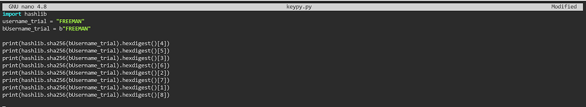
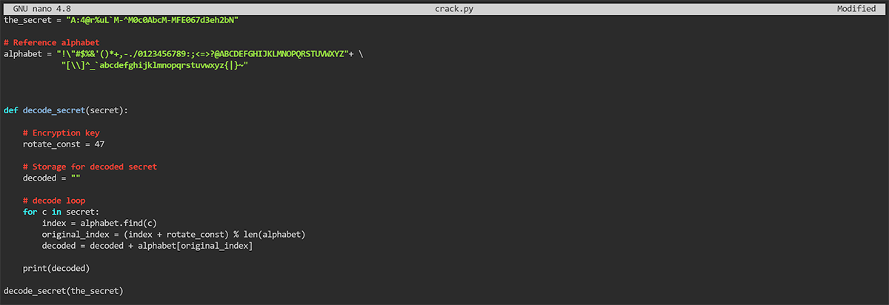
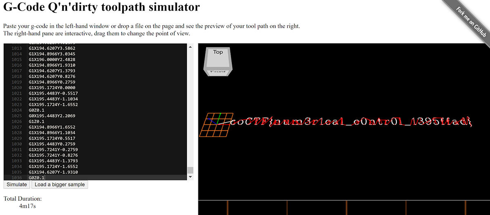

# Reverse Engineering

*Solved: 10, Points: 680*
| Challenges | Points |
| ---- | ---- |
| [Transformation](#transformation-20-pts) | 20 pts |
| [Keygenme-py ](#keygenme-py-30-pts) | 30 pts |
| [Crackme-py](#creackme-py-30-pts) | 30 pts |
| [ARMssembly 0](#armssembly-0-40-pts) | 40 pts |
| [Speeds and feeds](#speeds-and-feeds-50-pts) | 70 pts |
| [Shop](#shop-50-pts) | 50 pts |
| [ARMssembly 1](#armssembly-1-70-pts) | 70 pts |
| [ARMssembly 2](#armssembly-2-90-pts) | 90 pts |
| [ARMssembly 3](#armssembly-3-130-pts) | 130 pts |
| [ARMssembly 4](#armssembly-4-170-pts) | 170 pts |

## Transformation (20 pts)

>I wonder what this really is... [enc](https://mercury.picoctf.net/static/e47483f88b12f2ab0c46315afc12f64d/enc)  
`''.join([chr((ord(flag[i]) << 8) + ord(flag[i + 1])) for i in range(0, len(flag), 2)])`  
Hint: You may find some decoders online.  

*_Taya*

## Keygenme-py (30 pts)

>[keygenme-trial.py](https://mercury.picoctf.net/static/fb75b48f9214cf992a2199b5785564e7/keygenme-trial.py)

Inspecting the given python script with Notepad as a txt file, these parts stand out:

    username_trial = "FREEMAN"
    bUsername_trial = b"FREEMAN"
and

    key_part_static1_trial = "picoCTF{1n_7h3_|<3y_of_"
    key_part_dynamic1_trial = "xxxxxxxx"
    key_part_static2_trial = "}"
    key_full_template_trial = key_part_static1_trial + key_part_dynamic1_trial + key_part_static2_trial
    
Inspecting further, it becomes clear that when a “license” is entered, check_key is run with the imputed license and the following checks are done: (key is the user license input)  
1. The input needs to be the same lengths as `picoCTF{1n_7h3_|<3y_of_xxxxxxxx}`  
    
        if len(key) != len(key_full_template_trial):
            return False

2. The first part of the license needs to be `picoCTF{1n_7h3_|<3y_of_`  
    
        i = 0
        for c in key_part_static1_trial:
            if key[i] != c:
                return False
                
3. Then the “dynamic part” is checked. The following code is repeated 8 times where x is (in this order) 4, 5, 3, 6, 2, 7, 1, 8 
        
        if key[i] != hashlib.sha256(username_trial).hexdigest()[x]:
            return False
        else:
            i += 1

To figure out what values were being checked, I coded and ran this python script in the webshell:

The output is `0 d 2 0 8 3 9 2` (separated by newlines)  
And so the flag is `picoCTF{1n_7h3_|<3y_of_0d208392}`  

*_Tiare*

## Crackme-py (30 pts)

>[crackme.py](https://mercury.picoctf.net/static/2ff6c888060f14af5db1232e319547c9/crackme.py)  

If you download and view the given python script, you realize that the code appears to run a really useless and incomplete number comparison.

But at the beginning, it has a strange alphabet string and this string variable: 

    bezos_cc_secret = "A:4@r%uL`M-^M0c0AbcM-MFE067d3eh2bN"

Then lower down, a ROT47 encryption/decryption (it is the same operation) function is coded but never called. So I wrote a python script that called the ROT47 function on the `bezos_cc_secret`:

  

The output is the flag:  
`picoCTF{1|\/|_4_p34|\|ut_ef5b69a3}`  

*_Tiare*

## ARMssembly 0 (40 pts)

>What integer does this program print with arguments `4134207980` and `950176538`? File: [chall.S](https://mercury.picoctf.net/static/da36e19990a2cede1dff10f9f33fe4b4/chall.S)  
Flag format: picoCTF{XXXXXXXX} -> (hex, lowercase, no 0x, and 32 bits. ex. 5614267 would be picoCTF{0055aabb})  
Hint: Simple compare

*_Taya*

## Speeds and feeds (50 pts)

>There is something on my shop network running at `nc mercury.picoctf.net 16524`, but I can't tell what it is. Can you?  
Hint: What language does a CNC machine use?

Connecting to the network in the webshell gives a really long, funky-looking output.

    G1X11.1724Y0.2759
    G1X12.0000Y0.0000
    G1X12.5517Y0.0000
    G1X13.3793Y0.2759
    G1X13.9310Y0.8276
    G0Z0.1
    G0X12.0000Y3.8621
    G1Z0.1

... And on and on. 

Looking at the hint, with some extra research, *“G-code is the programming language used to control CNC machinery”* (more info [here](https://www.steckermachine.com/blog/g-code-m-code#:~:text=G%2Dcode%20is%20the%20programming,the%20machine%20what%20to%20do.)). So we copy and paste the output of in the webshell into a [G-Code compiler](https://nraynaud.github.io/webgcode/):

(because the output was so long, the top part of the G-Code gets cut off in the webshell, but we know that the format is picoCTF{...})

The flag: `picoCTF{num3r1cal_c0ntr0l_1395ffad}`  

*_Tiare*

## Shop (50 pts)

>Best Stuff - Cheap Stuff, Buy Buy Buy... Store Instance: [source](https://mercury.picoctf.net/static/bd84b0d8b57e043a028c36381910d0b7/source). The shop is open for business at `nc mercury.picoctf.net 11371.`  
Hint: Always check edge cases when programming.  

*_Taya*

## ARMssembly 1 (70 pts)

>For what argument does this program print `win` with variables `68`, `2` and `3`? File: [chall_1.S](https://mercury.picoctf.net/static/d6c56d724795c006b319c6aa6a09140e/chall_1.S)  
Flag format: picoCTF{XXXXXXXX} -> (hex, lowercase, no 0x, and 32 bits. ex. 5614267 would be picoCTF{0055aabb})  
Hint: Shifts

*_Taya*

## ARMssembly 2 (90 pts)

>What integer does this program print with argument `2403814618`? File: [chall_2.S](https://mercury.picoctf.net/static/56bca09e5374884d0faa8c53aad9c642/chall_2.S)  
Flag format: picoCTF{XXXXXXXX} -> (hex, lowercase, no 0x, and 32 bits. ex. 5614267 would be picoCTF{0055aabb})  
Hint: Loops

*_Taya*

## ARMssembly 3 (130 pts)

>What integer does this program print with argument `3634247936`? File: [chall_3.S](https://mercury.picoctf.net/static/f3ce1850e41ec20724ef2bf0234f1de6/chall_3.S)  
Flag format: picoCTF{XXXXXXXX} -> (hex, lowercase, no 0x, and 32 bits. ex. 5614267 would be picoCTF{0055aabb})  
Hint: beep boop beep boop...  

*_Taya*

## ARMssembly 4 (170 pts)

>What integer does this program print with argument `1215610622`? File: [chall_4.S](https://mercury.picoctf.net/static/cc482f9af012669801cf7adeb687698a/chall_4.S)  
Flag format: picoCTF{XXXXXXXX} -> (hex, lowercase, no 0x, and 32 bits. ex. 5614267 would be picoCTF{0055aabb})  
Hint: Switching things up

*_Taya*
