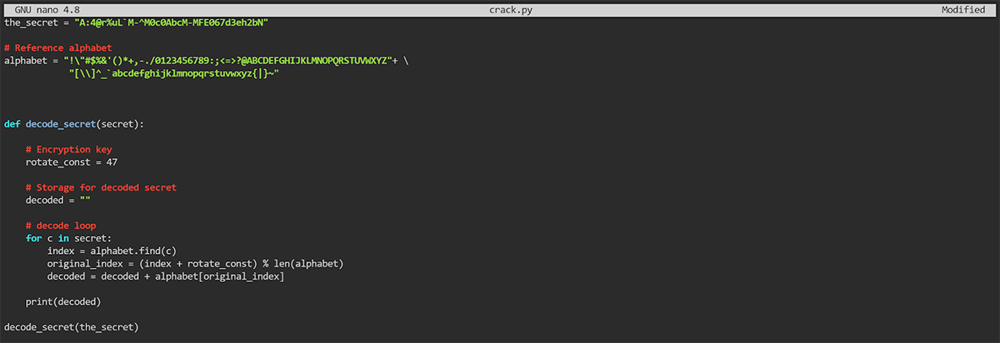
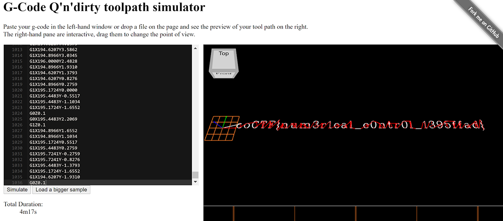

# Reverse Engineering

*Solved: 10, Points: 680*
| Challenges | Points |
| ---- | ---- |
| [Transformation](#transformation-20-pts) | 20 pts |
| [Keygenme-py ](#keygenme-py-30-pts) | 30 pts |
| [Crackme-py](#creackme-py-30-pts) | 30 pts |
| [ARMssembly 0](#armssembly-0-40-pts) | 40 pts |
| [Speeds and feeds](#speeds-and-feeds-50-pts) | 70 pts |
| [Shop](#shop-50-pts) | 50 pts |
| [ARMssembly 1](#armssembly-1-70-pts) | 70 pts |
| [ARMssembly 2](#armssembly-2-90-pts) | 90 pts |
| [ARMssembly 3](#armssembly-3-130-pts) | 130 pts |
| [ARMssembly 4](#armssembly-4-170-pts) | 170 pts |

## Transformation (20 pts)

>I wonder what this really is... [enc](https://mercury.picoctf.net/static/e47483f88b12f2ab0c46315afc12f64d/enc)  
`''.join([chr((ord(flag[i]) << 8) + ord(flag[i + 1])) for i in range(0, len(flag), 2)])`  
Hint: You may find some decoders online.  

In this problem they give you the encoded flag in the file `enc` and the encoding method. The encoded flag is essentially taking 2 8 bit characters from the flag and putting them together to get 16 bit characcters. I used [this website](https://r12a.github.io/app-conversion/) which takes unicode characters and outputs a bunch of different formats. The `UTF-16 code units` output gives this:
    
    7069 636F 4354 467B 3136 5F62 6974 735F 696E 7374 3334 645F 6F66 5F38 5F65 3134 3161 3066 377D

I put that into a [hex to ascii converter](https://www.rapidtables.com/convert/number/hex-to-ascii.html) and got the flag: `picoCTF{16_bits_inst34d_of_8_e141a0f7}`

*_Taya*

## Keygenme-py (30 pts)

>[keygenme-trial.py](https://mercury.picoctf.net/static/fb75b48f9214cf992a2199b5785564e7/keygenme-trial.py)

Inspecting the given python script with Notepad as a txt file, these parts stand out:

    username_trial = "FREEMAN"
    bUsername_trial = b"FREEMAN"
and

    key_part_static1_trial = "picoCTF{1n_7h3_|<3y_of_"
    key_part_dynamic1_trial = "xxxxxxxx"
    key_part_static2_trial = "}"
    key_full_template_trial = key_part_static1_trial + key_part_dynamic1_trial + key_part_static2_trial
    
Inspecting further, it becomes clear that when a “license” is entered, check_key is run with the imputed license and the following checks are done: (key is the user license input)  
1. The input needs to be the same lengths as `picoCTF{1n_7h3_|<3y_of_xxxxxxxx}`  
    
        if len(key) != len(key_full_template_trial):
            return False

2. The first part of the license needs to be `picoCTF{1n_7h3_|<3y_of_`  
    
        i = 0
        for c in key_part_static1_trial:
            if key[i] != c:
                return False
                
3. Then the “dynamic part” is checked. The following code is repeated 8 times where x is (in this order) 4, 5, 3, 6, 2, 7, 1, 8 
        
        if key[i] != hashlib.sha256(username_trial).hexdigest()[x]:
            return False
        else:
            i += 1

To figure out what values were being checked, I coded and ran this python script in the webshell:

The output is `0 d 2 0 8 3 9 2` (separated by newlines)  
And so the flag is `picoCTF{1n_7h3_|<3y_of_0d208392}`  

*_Tiare*

## Crackme-py (30 pts)

>[crackme.py](https://mercury.picoctf.net/static/2ff6c888060f14af5db1232e319547c9/crackme.py)  

If you download and view the given python script, you realize that the code appears to run a really useless and incomplete number comparison.

But at the beginning, it has a strange alphabet string and this string variable: 

    bezos_cc_secret = "A:4@r%uL`M-^M0c0AbcM-MFE067d3eh2bN"

Then lower down, a ROT47 encryption/decryption (it is the same operation) function is coded but never called. So I wrote a python script that called the ROT47 function on the `bezos_cc_secret`:

  

The output is the flag:  
`picoCTF{1|\/|_4_p34|\|ut_ef5b69a3}`  

*_Tiare*

## ARMssembly 0 (40 pts)

>What integer does this program print with arguments `4134207980` and `950176538`? File: [chall.S](https://mercury.picoctf.net/static/da36e19990a2cede1dff10f9f33fe4b4/chall.S)  
Flag format: picoCTF{XXXXXXXX} -> (hex, lowercase, no 0x, and 32 bits. ex. 5614267 would be picoCTF{0055aabb})  
Hint: Simple compare

The given assembly code just compares the 2 inputs and outputs the larger one. Since the larger input is `4134207980` I just converted that to hex and that was the flag: 
`picoCTF{f66b01ec}`

*_Taya*

## Speeds and feeds (50 pts)

>There is something on my shop network running at `nc mercury.picoctf.net 16524`, but I can't tell what it is. Can you?  
Hint: What language does a CNC machine use?

Connecting to the network in the webshell gives a really long, funky-looking output.

    G1X11.1724Y0.2759
    G1X12.0000Y0.0000
    G1X12.5517Y0.0000
    G1X13.3793Y0.2759
    G1X13.9310Y0.8276
    G0Z0.1
    G0X12.0000Y3.8621
    G1Z0.1

... And on and on. 

Looking at the hint, with some extra research, *“G-code is the programming language used to control CNC machinery”* (more info [here](https://www.steckermachine.com/blog/g-code-m-code#:~:text=G%2Dcode%20is%20the%20programming,the%20machine%20what%20to%20do.)). So we copy and paste the output of in the webshell into a [G-Code compiler](https://nraynaud.github.io/webgcode/):

(because the output was so long, the top part of the G-Code gets cut off in the webshell, but we know that the format is picoCTF{...})

The flag: `picoCTF{num3r1cal_c0ntr0l_1395ffad}`  

*_Tiare*

## Shop (50 pts)

>Best Stuff - Cheap Stuff, Buy Buy Buy... Store Instance: [source](https://mercury.picoctf.net/static/bd84b0d8b57e043a028c36381910d0b7/source). The shop is open for business at `nc mercury.picoctf.net 11371.`  
Hint: Always check edge cases when programming.  

Connect to `nc mercury.picoctf.net 11371` in the webshell and it brings up a menu:
    
    Welcome to the market!
    =====================
    You have 40 coins
            Item            Price   Count
    (0) Quiet Quiches       10      12
    (1) Average Apple       15      8
    (2) Fruitful Flag       100     1
    (3) Sell an Item
    (4) Exit
    Choose an option: 

After some trial and error I realised that the shop allowed you to purchase negative items. All that is necessary is to enter `1` to purchase Average Apple and then `-4`. This will get you to the necessary 100 coins and then you can purchase the Fruitful Flag. This gives you the following output: 

    Flag is:  [112 105 99 111 67 84 70 123 98 52 100 95 98 114 111 103 114 97 109 109 101 114 95 98 56 100 55 50 55 49 102 125]

Then you can use any decimal to ascii converter such as [this one](https://www.rapidtables.com/convert/number/ascii-hex-bin-dec-converter.html) to get the flag: `picoCTF{b4d_brogrammer_b8d7271f}` 

*_Taya*

## ARMssembly 1 (70 pts)

>For what argument does this program print `win` with variables `68`, `2` and `3`? File: [chall_1.S](https://mercury.picoctf.net/static/d6c56d724795c006b319c6aa6a09140e/chall_1.S)  
Flag format: picoCTF{XXXXXXXX} -> (hex, lowercase, no 0x, and 32 bits. ex. 5614267 would be picoCTF{0055aabb})  
Hint: Shifts

The assembly code give has the following important lines in the main function:

    bl	    func
	cmp	    w0, 0
	bne	    .L4
	adrp	x0, .LC0

.LC0 has the string "You win!" So we know that we want `adrp x0, .LC0` to execute. That means that we need the value returned from func in w0 needs to be 0.

func looks like this:

    sub	    sp, sp, #32
	str	    w0, [sp, 12]
	mov	    w0, 68
	str	    w0, [sp, 16]
	mov	    w0, 2
	str	    w0, [sp, 20]
	mov	    w0, 3
	str	    w0, [sp, 24]
	ldr	    w0, [sp, 20]
	ldr	    w1, [sp, 16]
	lsl	    w0, w1, w0
	str	    w0, [sp, 28]
	ldr	    w1, [sp, 28]
	ldr	    w0, [sp, 24]
	sdiv	w0, w1, w0
	str	    w0, [sp, 28]
	ldr	    w1, [sp, 28]
	ldr	    w0, [sp, 12]
	sub	    w0, w1, w0
	str	    w0, [sp, 28]
	ldr	    w0, [sp, 28]
	add	    sp, sp, 32
	ret

Working backwards we know that the value returned in w0 is set in the line `sub	w0, w1, w0`. So we need w1 and w0 to be equal at that point. w0 holds the value stored in memory at an offset of 12 from the stack pointer (`ldr w0, [sp, 12]`). Working back this is set in the second line of func(`str w0, [sp, 12]`) to be the input of the function. To find w1 we just need to work through the steps in the func:

    w0 = 2
    w1 = 68
    w0 = w1 << w0
    w1 = w0
    w0 = 3
    w0 = w1/w0
    w1 = w0

so w1 = 90. Convert to hex and the flag is: `picoCTF{0000005a}`

*_Taya*

## ARMssembly 2 (90 pts)

>What integer does this program print with argument `2403814618`? File: [chall_2.S](https://mercury.picoctf.net/static/56bca09e5374884d0faa8c53aad9c642/chall_2.S)  
Flag format: picoCTF{XXXXXXXX} -> (hex, lowercase, no 0x, and 32 bits. ex. 5614267 would be picoCTF{0055aabb})  
Hint: Loops

Looking at the assembly file we need to find what is returned from func1 in w0. This is the code in func1:

    func1:
        sub	    sp, sp, #32
        str	    w0, [sp, 12]
        str	    wzr, [sp, 24]
        str	    wzr, [sp, 28]
        b	    .L2
    .L3:
        ldr	    w0, [sp, 24]
        add	    w0, w0, 3
        str	    w0, [sp, 24]
        ldr	    w0, [sp, 28]
        add 	w0, w0, 1
        str	    w0, [sp, 28]
    .L2:
        ldr	    w1, [sp, 28]
        ldr	    w0, [sp, 12]
        cmp	    w1, w0
        bcc	    .L3
        ldr	    w0, [sp, 24]
        add	    sp, sp, 32
        ret

When `bcc .L3` does not branch to .L3 the value stored at an offset of 24 from the stack pointer (sp) is returned. `bcc` means branch if carry clear. The carry bit is set in the line `cmp w1, w0` and it is only set if w1 is less than w0. Summary of the assembly code:

    input = 2403814618
    sp_offset24 = 0
    sp_offset28 = 0
    while (sp_offset28 <= input) {
        sp_offset24 +=3
        sp_offset28 +=1
    }
    return sp_offset24

so to find the value returned we just need to do 2403814618*3=7211443854 - in hex: 1add5e68e. Since the answer only accepts 32 bits, the flag is: `picoCTF{add5e68e}`

*_Taya*

## ARMssembly 3 (130 pts)

>What integer does this program print with argument `3634247936`? File: [chall_3.S](https://mercury.picoctf.net/static/f3ce1850e41ec20724ef2bf0234f1de6/chall_3.S)  
Flag format: picoCTF{XXXXXXXX} -> (hex, lowercase, no 0x, and 32 bits. ex. 5614267 would be picoCTF{0055aabb})  
Hint: beep boop beep boop...  

Again we need to determine what is returned from func1:

    func1:
        stp	x29, x30, [sp, -48]!
        add	x29, sp, 0
        str	w0, [x29, 28]
        str	wzr, [x29, 44]
        b	.L2
    .L4:
        ldr	w0, [x29, 28]
        and	w0, w0, 1
        cmp	w0, 0
        beq	.L3
        ldr	w0, [x29, 44]
        bl	func2
        str	w0, [x29, 44]
    .L3:
        ldr	w0, [x29, 28]
        lsr	w0, w0, 1
        str	w0, [x29, 28]
    .L2:
        ldr	w0, [x29, 28]
        cmp	w0, 0
        bne	.L4
        ldr	w0, [x29, 44]
        ldp	x29, x30, [sp], 48
        ret
        .size	func1, .-func1
        .align	2
        .global	func2
        .type	func2, %function
    func2:
        sub	sp, sp, #16
        str	w0, [sp, 12]
        ldr	w0, [sp, 12]
        add	w0, w0, 3
        add	sp, sp, 16
        ret

The return for func1 is in .L2 and it returns when w0, loaded from offset 28 to the stack pointer (sp) is 0. Translating into more understandable code:

    func2(sp_offset44){
        return sp_offset44+3
    }    
    
    input = 3634247936
    sp_offset44 = 0
    while(input != 0){
        if((input & 1 != 0)){ //bitwise and
            sp_offset44 = func2(sp_offset44)
        }
        input = input >> 1
    }
    return sp_offset44

Everytime input & 1 is not 0, 3 is added to sp_offset44 then input is shifted to the right by 1 bit. input & 1 is only non-zero if input has a `1` in the smallest bit posititon. Converting 3634247936 to binary: `11011000100111100011100100000000`. It has 13 ones so we know the return value is 3*13 = 39. Convert to hex and the flag is: `picoCTF{00000027}`

*_Taya*

## ARMssembly 4 (170 pts)

>What integer does this program print with argument `1215610622`? File: [chall_4.S](https://mercury.picoctf.net/static/cc482f9af012669801cf7adeb687698a/chall_4.S)  
Flag format: picoCTF{XXXXXXXX} -> (hex, lowercase, no 0x, and 32 bits. ex. 5614267 would be picoCTF{0055aabb})  
Hint: Switching things up

This assembly problem has significantly more code than the others, but it is just a series of different comparisons that branch down different paths.

First:
    func1:
        stp	x29, x30, [sp, -32]!
        add	x29, sp, 0
        str	w0, [x29, 28]
        ldr	w0, [x29, 28]
        cmp	w0, 100
        bls	.L2
        ldr	w0, [x29, 28]
        add	w0, w0, 100
        bl	func2
        b	.L3
    .L2:
        ldr	w0, [x29, 28]
        bl	func3
    .L3:
        ldp	x29, x30, [sp], 32
        ret

This compares the input with 100. If it is less than it jumps to func3, otherwise it adds 100 and jumps to func2.  1215610622 is not less than 100 the input is now 1215610722 and it jumps to func2.

    func2:
        stp	x29, x30, [sp, -32]!
        add	x29, sp, 0
        str	w0, [x29, 28]
        ldr	w0, [x29, 28]
        cmp	w0, 499
        bhi	.L5
        ldr	w0, [x29, 28]
        sub	w0, w0, #86
        bl	func4
        b	.L6
    .L5:
        ldr	w0, [x29, 28]
        add	w0, w0, 13
        bl	func5
    .L6:
        ldp	x29, x30, [sp], 32
        ret

This compares input with 499. If input is greater than 499 with unsigned comparison (which it is) then it goes to .L5 where it adds 13 and then jumps to func5. Now the input is 1215610735 and func5 is executing.

    func5:
        stp	x29, x30, [sp, -32]!
        add	x29, sp, 0
        str	w0, [x29, 28]
        ldr	w0, [x29, 28]
        bl	func8
        str	w0, [x29, 28]
        ldr	w0, [x29, 28]
        ldp	x29, x30, [sp], 32
        ret

func5 just jumps to func8

    func8:
        sub	sp, sp, #16
        str	w0, [sp, 12]
        ldr	w0, [sp, 12]
        add	w0, w0, 2
        add	sp, sp, 16
        ret

func8 adds 2 to the input and then returns. The returned value is 1215610735+2 = 1215610737. Convert to hex and the flag is: `picoCTF{4874bf71}`

*_Taya*
