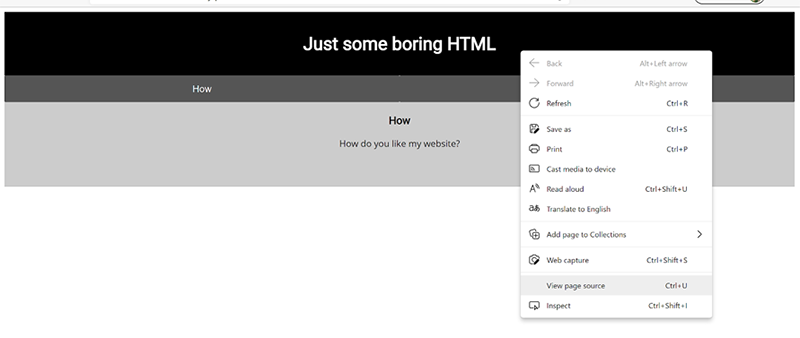

# Web Exploitation

*Solved: 8, Points: 570*
| Challenges | Points |
| ---- | ---- |
| [Ancient History](#ancient-history-10-pts) | 10 pts |
| [GET aHEAD](#get-ahead-20-pts) | 20 pts |
| [Cookies](#cookies-40-pts) | 40 pts |
| [Scavenger Hunt](#scavenger-hunt-50-pts) | 50 pts |
| [Some Assemly Required 1](#some-assembly-required-1-70-pts) | 70 pts |
| [Who are you?](#who-are-you-100-pts) | 100 pts |
| [Super Serial](#super-serial-130-pts) | 130 pts |
| [Most Cookies](#most-cookies-150-pts) | 150 pts |

## Ancient History (10 pts)

This problem is no longer available in the picoGYM to redo but the general idea was that going to the link in the problem sequentially redirected to new web pages. The flag was obtained by repeatedly clicking the back button in the browser and noting the last letter of the url (the file name). Backwards, they were the flag.

[another team's write-up](https://github.com/vivian-dai/PicoCTF2021-Writeup/blob/main/Web%20Exploitation/Ancient%20History/Ancient%20History.md)

*_Tiare*

## GET aHEAD (20 pts)

>Find the flag being held on this server to get ahead of the competition [http://mercury.picoctf.net:15931/](http://mercury.picoctf.net:15931/)  
Hint 1: Maybe you have more than 2 choices  
Hint 2: Check out tools like Burpsuite to modify your requests and look at the responses  

Using Burpsuite (proxy>open browser), we notice that clicking the website buttons prompts different HTTP methods. Clicking “choose red” causes a GET request to be sent to the server and clicking “choose blue” causes a POST request to be sent.

Looking at the hint “Maybe you have more than 2 choices” and the interesting capitalization in the challenge title (GET aHEAD) - and an undisclosed amount of googling - we come to the idea of a HEAD request (another type of HTTP request, which only requests __header__ information).

Taya then does some kind of magical inferring or something and realizes that entering `$ curl -I http://mercury.picoctf.net:15931/` in the webshell displays the flag in its output:
    
    HTTP/1.1 200 OK
    flag: picoCTF{r3j3ct_th3_du4l1ty_82880908}
    Content-type: text/html; charset=UTF-8

*_Tiare & Taya*

## Cookies (40 pts)

>Who doesn't love cookies? Try to figure out the best one. [http://mercury.picoctf.net:21485/](http://mercury.picoctf.net:21485/)  

*_Taya*

## Scavenger Hunt (50 pts)

>There is some interesting information hidden around this site [http://mercury.picoctf.net:27393/](http://mercury.picoctf.net:27393/). Can you find it?  
Hint: You should have enough hints to find the files, don't run a brute forcer.  

The key idea of this problem is accessing the web files of a website through URLs. When a website is made, it is composed of several different pages, each one saved as a file. The hardest part of this problem was finding the file names with the hints given…

Viewing the source code of the site given gives the first part of the flag:

  
  
Clicking on the css file link in the page source (or accessing it at [mercury.picoctf.net:27393/mycss.css](http://mercury.picoctf.net:27393/mycss.css)) gives the next part of the flag:  

    /* CSS makes the page look nice, and yes, it also has part of the flag. Here's part 2: h4ts_4_l0 */
The Javascript file of the website ([mercury.picoctf.net:27393/myjs.js](http://mercury.picoctf.net:27393/myjs.js)) gives the next hint:  

    /* How can I keep Google from indexing my website? */
Answer: robots.txt. *“A robots.txt file tells search engine crawlers which pages or files the crawler can or can't request from your site.”* At [mercury.picoctf.net:27393/robots.txt](http://mercury.picoctf.net:27393/robots.txt), we find:
    
    # Part 3: t_0f_pl4c
    # I think this is an apache server... can you Access the next flag?
    
Apache HTTP Server Tutorial: *“.htaccess files (or "distributed configuration files") provide a way to make configuration changes on a per-directory basis.”* At [mercury.picoctf.net:27393/.htaccess](http://mercury.picoctf.net:27393/.htaccess), we find:

    # Part 4: 3s_2_lO0k
    # I love making websites on my Mac, I can Store a lot of information there.
Finally, we find the last part of the flag at [mercury.picoctf.net:27393/.DS_Store](http://mercury.picoctf.net:27393/.DS_Store) *“In the Apple macOS operating system, .DS_Store is a file that stores custom attributes of its containing folder, such as the position of icons or the choice of a background image.”*  
`Congrats! You completed the scavenger hunt. Part 5: _d375c750}`

Altogether, the flag is  `picoCTF{th4ts_4_l0t_0f_pl4c3s_2_lO0k_d375c750}`

*_Taya, Tiare, Kieryn & Eddie*

## Some Assemly Required 1 (70 pts)

>[http://mercury.picoctf.net:15472/index.html](http://mercury.picoctf.net:15472/index.html)  

*_Taya*

## Who are you? (100 pts)

>Let me in. Let me iiiiiiinnnnnnnnnnnnnnnnnnnn [http://mercury.picoctf.net:52362/](http://mercury.picoctf.net:52362/)  
Hint: It ain't much, but it's an RFC [https://tools.ietf.org/html/rfc2616](https://tools.ietf.org/html/rfc2616)  

This problem is all about the information sent in HTTP requests to servers that identify the user trying to access the website. I used the Burpsuite proxy to modify/add HTTP request [headers](https://en.wikipedia.org/wiki/List_of_HTTP_header_fields).  

1. __Only people who use the official PicoBrowser are allowed on this site!__    
Change `User-Agent` from `Mozilla/5.0` to `PicoBrowser/5.0`  

2. __I don’t trust users visiting from another site__  
Add `Referer` header that had the site url as its value (`mercury.picoctf.net:52362`)   

3. __Sorry, this site only worked in 2018.__  
Add `Date` header with any date in 2018 (formatting was a beach) Ex. `Date: Sun, 04 Feb 2018 07:28:00 GMT`  

4. __I don’t trust users who can be tracked.__  
`DNT` header (Do Not Track) set to `true` (value of `1`)  

5. __This website is only for people from Sweden.__  
`X-Forwarded-For` header with a Swedish IP address from Google (I used `178.73.220.6`)  

6. __You’re in Sweden but you don’t speak Swedish?__  
`Accept-Language` header. The language code for sweden is `sv`  

7. __What can I say except, you are welcome__  
`picoCTF{http_h34d3rs_v3ry_c0Ol_much_w0w_0c0db339}`  

The entire HTTP request by the end:  
>`GET / HTTP/1.1  
Host: mercury.picoctf.net:52362  
__Referer: mercury.picoctf.net:52362__  
__Date: Sun, 04 Feb 2018 07:28:00 GMT__  
Cache-Control: max-age=0  
__DNT: 1__  
Upgrade-Insecure-Requests: 1  
__User-Agent: PicoBrowser__/5.0 (Windows NT 10.0; Win64; x64) AppleWebKit/537.36 (KHTML, like Gecko) Chrome/89.0.4389.90 Safari/537.36  
Accept: text/html,application/xhtml+xml,application/xml;q=0.9,image/avif,image/webp,image/apng,*/*;q=0.8,application/signed-exchange;v=b3;q=0.9  
__X-Forwarded-For: 178.73.220.6__  
Accept-Encoding: gzip, deflate  
__Accept-Language: sv__  
Connection: close`

_Taya & Tiare

## Super Serial (130 pts)

>Try to recover the flag stored on this website [http://mercury.picoctf.net:14804/](http://mercury.picoctf.net:14804/)  
Hint: The flag is at ../flag

*_Taya*

## Most Cookies (150 pts)

>Alright, enough of using my own encryption. Flask session cookies should be plenty secure! [server.py](https://mercury.picoctf.net/static/1e4bd835ad3e7fe776d49e7b8cc280c1/server.py) [http://mercury.picoctf.net:35697/](http://mercury.picoctf.net:35697/)  
 Hint: How secure is a flask cookie?

*DEDICATION: John Hammond, you are THE MAN!! [His YouTube video on forging flask cookies](https://www.youtube.com/watch?v=kru8On32BqY)*

Opening the site using BurpSuite’s Proxy, we notice a cookie header in the HTTP request:  
>Cookie: session=__eyJ2ZXJ5X2F1dGgiOiJibGFuayJ9__.YIHE2A.__5zGfn8ts-Vkj_UjOTgmi7gNQSoc__

Thanks to [some dude’s informative blog post](https://blog.paradoxis.nl/defeating-flasks-session-management-65706ba9d3ce), we know the __first bolded part of the cookie__ is the session data and the __second bolded part of the cookie__ is the cryptographic hash (a calculated sha1 hash based on the session data, the timestamp and the server’s secret key). The hash needs to be valid for the cookie to be valid.

Using a [base64 decoder](https://www.base64decode.org/), we find that the session data is `{"very_auth":"blank"}`
Looking at the “server.py” python script, a couple things stand out:

#1 - the server's secret key is a random string from `cookie_names`
    
    cookie_names = ["snickerdoodle", "chocolate chip", "oatmeal raisin", "gingersnap", "shortbread", "peanut butter", "whoopie pie", "sugar", "molasses", "kiss", "biscotti", "butter", "spritz", "snowball", "drop", "thumbprint", "pinwheel", "wafer", "macaroon", "fortune", "crinkle", "icebox", "gingerbread", "tassie", "lebkuchen", "macaron", "black and white", "white chocolate macadamia"]
    app.secret_key = random.choice(cookie_names)
    
#2 - to get the flag, we need to forge a flask cookie whose session data is `{"very_auth":"admin"}`

    if session.get("very_auth"):
        check = session["very_auth"]
        if check == "admin":
            resp = make_response(render_template("flag.html", value=flag_value, title=title))
			return resp

Using John Hammond's SUPER AWESOME video and this [useful code from GitHub](https://github.com/noraj/flask-session-cookie-manager/blob/master/flask_session_cookie_manager3.py), we can write a python script in the pico webshell that will forge and test flask session cookies. Since the seret key could be any of the strings in `cookie_names`, the code tries each one.

*Note: during the actual competition, the code just generated the encoded flask cookies and I tested each one manually using BurpSuite, but this is a much better way courtesy of [this dude](https://www.youtube.com/watch?v=7DCHD6oEf68)*

  

The important part of the output (with the flag highlighted):

The flag: `picoCTF{pwn_4ll_th3_cook1E5_22fe0842}`  
*_Tiare*

